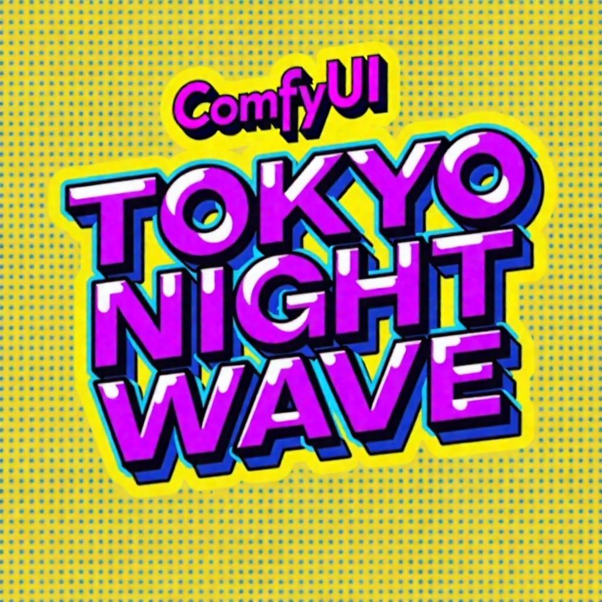
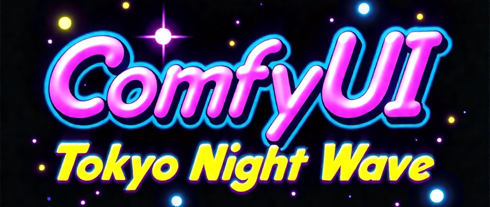
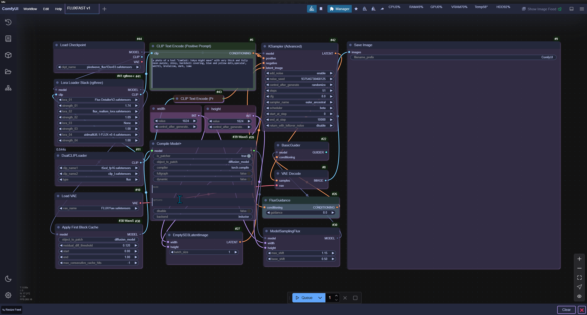

# 🌃🌊 Tokyo Night Wave - ComfyUI Theme

<p align="center">
  
</p>

## 🎨 Aesthetic Fusion of Cyberpunk Elegance and Night-time Serenity

<p align="center">
  
</p>

## 🖥 Theme Preview

<p align="center">
  
</p>

## 🚀 Overview

Tokyo Night Wave is a meticulously crafted theme for ComfyUI, designed to transform your AI workflow interface into a visually stunning, synthwave-inspired workspace. Perfect for AI artists and developers who crave a unique, eye-catching environment while working with ComfyUI.

**Key Design Philosophy**:
- 🎨 Seamlessly blend functionality with aesthetic appeal
- 🌃 Capture the essence of late-night coding and AI creativity
- 🌊 Provide a visually comfortable interface for long ComfyUI sessions

## ✨ Key Features

- **Cyberpunk Color Palette**: 
  - Deep midnight blues
  - Vibrant neon accents
  - Soft, glowing purples
  - Synthwave-inspired gradients
- **Carefully Crafted Color Scheme**:
  - Syntax highlighting optimized for readability
  - Balanced contrast for reduced eye strain
  - Consistent color mapping across UI elements

## 🎭 Visual Characteristics

- **Background**: Deep navy with subtle digital noise texture
- **Accent Colors**: 
  - Primary: `#7E57C2` (Synthwave Purple)
  - Secondary: `#1A1B26` (Tokyo Night Dark)
  - Highlight: `#BB9AF7` (Soft Lavender)

## 🎨 Color Palette

<table align="center">
  <tr>
    <th>Color Role</th>
    <th>Hex Code</th>
    <th>Description</th>
  </tr>
  <tr>
    <td>Background</td>
    <td><code>#1A1B26</code></td>
    <td>Deep midnight blue</td>
  </tr>
  <tr>
    <td>Foreground</td>
    <td><code>#C0CAF5</code></td>
    <td>Soft lavender gray</td>
  </tr>
  <tr>
    <td>Primary Accent</td>
    <td><code>#7E57C2</code></td>
    <td>Synthwave purple</td>
  </tr>
  <tr>
    <td>Secondary Accent</td>
    <td><code>#BB9AF7</code></td>
    <td>Soft neon lavender</td>
  </tr>
</table>

## 🚀 How to Import the Theme

### 📦 Quick Import Steps

1. 🖱️ **Open ComfyUI**
   - Launch the ComfyUI application
   - Navigate to the theme settings

2. 🗂️ **Access Theme Manager**
   - Click on "Themes" or "Appearance" in the settings menu
   - Select "Import Theme"

3. 📁 **Locate Theme File**
   - Browse to the downloaded `tokyo-night-wave.json`
   - Select the file to import

4. ✅ **Confirm Import**
   - Click "Import" or "Apply"
   - Verify theme is selected in theme list

5. 🔄 **Finalize**
   - Choose `tokyo-night-wave.json`
   - Restart ComfyUI if prompted

### 💡 Pro Tips

> 🌟 **Best Practices**:
> - Always backup your current theme before importing
> - Ensure you have the latest version of ComfyUI
> - Keep the theme JSON file in an easily accessible location

### 🔍 Troubleshooting

**Common Issues**:
- **Theme Not Showing?** 
  - Verify file extension is `.json`
  - Check ComfyUI version compatibility
  - Restart ComfyUI after import

## 🛠 Installation

### ComfyUI Installation

1. Clone this repository
2. Place the theme files in your ComfyUI themes directory
3. Select "Tokyo Night Wave" in your theme settings

### Manual Installation

<p align="center">
1. Download `tokyo-night-wave.json`
2. Place in ComfyUI themes directory
3. Select theme in ComfyUI settings
</p>

### Compatibility

<p align="center">
- ComfyUI Version: `1.0+`
- Tested Platforms: Windows, macOS, Linux
</p>

## 🤝 Contributing

Contributions are welcome! Feel free to:
- Submit issues
- Create pull requests
- Suggest improvements

## 📜 License

MIT License - Free for personal and commercial use

## 🌊 About

Created with ❤️ by CLOUDWERX LAB

**Motto**: "Digital Food for the Analog Soul"

---

**Palette Inspiration**: 
A harmonious blend of deep night tones and vibrant synthwave energy, creating a visually striking and comfortable coding environment.

## 🚀 Recommended Settings

```json
{
  "theme": "Tokyo Night Wave",
  "brightness": 0.8,
  "contrast": 0.9,
  "neonIntensity": 0.7
}
```
